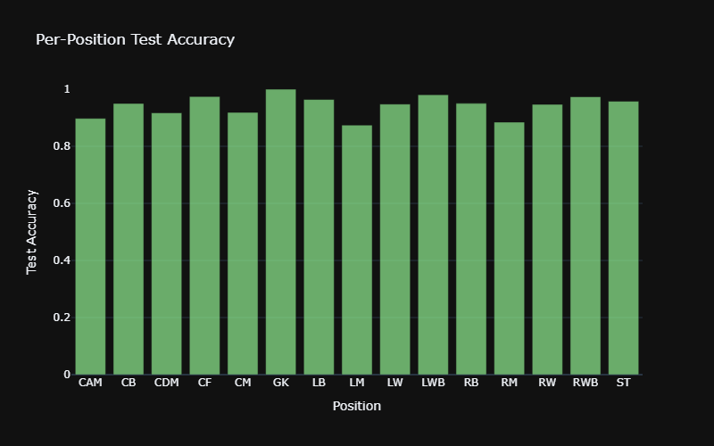
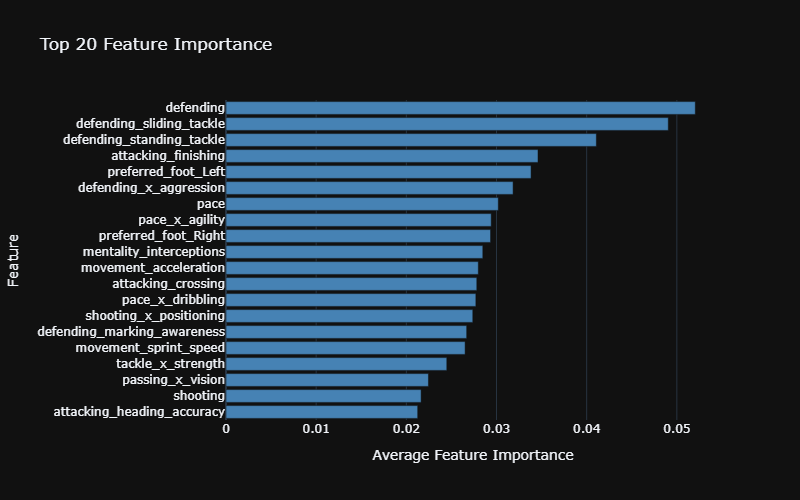

# FIFA Player Position Prediction

Trying to predict what positions a football player can play based on their stats.

## What it does

Takes FIFA player data (speed, shooting, passing etc) and predicts positions like ST, CM, GK.

Uses XGBoost multi-output classifier with ~15 different positions.

## How to run

Install stuff:

pip install -r requirements.txt

Run the pipeline:

python fifa_classifier.py

## Results

- Most positions: ~90% accuracy
- Some positions harder (LM/RM ~87%)
- Overall pretty good
- Exact match 48% (normal for multi-label)
- F1-Score: 70%

per-Position Test Accuracy

Avarage feature importance

## What I learned

- XGBoost works better than Random Forest here
- Feature selection helps (used top 40 features)
- Multi-label is tricky - exact match only 48% but individual positions 90%+
- Had to handle nationality different (too many categories)

## Files

- `fifa_classifier.py` - main code
- `requirements.txt` - dependencies
- `data/fifa_players.csv` - dataset

## Next steps

- Try different models
- More feature engineering
- Hyperparameter tuning

